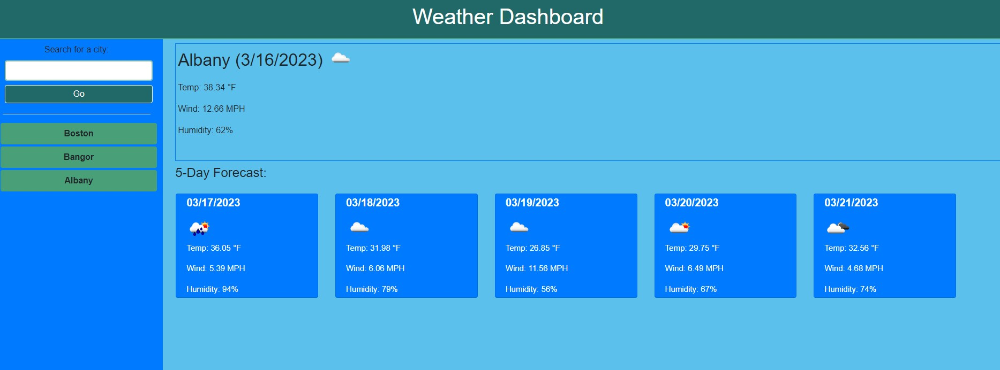

# Weather Dashboard

## Table of Contents
- [Description](#description)
- [Installation](#installation)
- [Usage](#usage)
- [Contribution](#contributing)
- [Testing](#tests)
- [Questions](#questions)
    
## Description 
The purpose of this project was to create an app that populates the five-day forecast when a city is entered. It aslo saves the searches for easy access in future searching. This project  makes use of third party API calls via the OpenWeatherAPI, and also ustilizes local storage to save searches. This project was completed with some assistance of another classmate.
## Installation 
To install simply clone this repo and run node index.js in an integrated terminal.
 
## Usage 
This project may be used to check the weather forecast for the next five days.
## Contribution 
I am not accepting contributions at this time.
## Testing 
There are no tests for this project.
## Questions 
If you have any questions at all feel free to contact me here or by email:
  
[GitHub](https://github.com/noahcote10)   
[noahcote10@gmail.com](mailto:noahcote10@gmail.com)